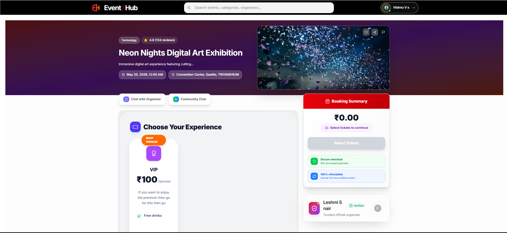
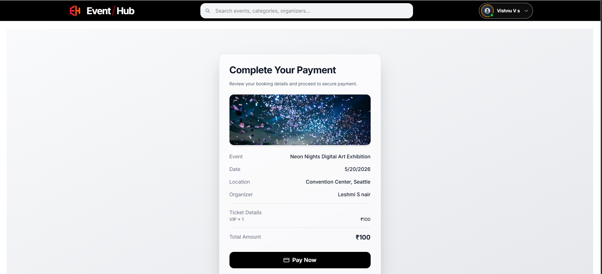
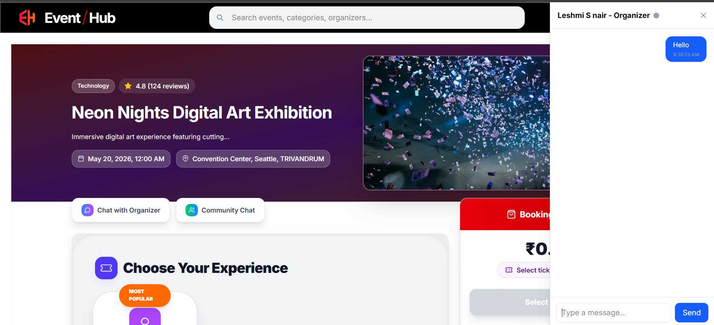

# 🎨 EventHub Frontend – Event Booking Platform

## 📌 Overview
EventHub frontend is a modern web application built using Next.js and TypeScript.  
It provides a seamless user experience for discovering events, booking tickets, chatting with organizers, and managing activities.

The application supports multiple roles (User, Organizer, Admin) and integrates with a scalable backend API and real-time communication services.

---

## 🚀 Features

- Multi-role interface (User, Organizer, Admin)
- Subscription plans system
- Secure authentication (OTP + JWT + Google OAuth)
- Stripe payment integration
- One-to-one chat with organizers
- Community chat system
- Real-time communication using Socket.IO
- Reviews, ratings, and reporting system
- Responsive UI with smooth animations

---

## 🛠️ Tech Stack

### Core
- Next.js (App Router)
- React 19
- TypeScript

### State & Forms
- Redux Toolkit
- React Hook Form
- Zod & Yup validation

### UI & Styling
- Tailwind CSS
- Radix UI
- Framer Motion
- Lucide React & Heroicons

### Networking & Real-Time
- Axios
- Socket.IO Client

### Authentication
- JWT
- Google OAuth

### Charts & UI Enhancements
- Recharts
- React CountUp
- React Day Picker

---

## 🗂️ Project Structure

```bash
frontend/
├── src/
│   ├── app/
│   ├── components/
│   ├── constants/
│   ├── enums/
│   ├── hooks/
│   ├── interface/
│   ├── lib/
│   ├── redux/
│   ├── services/
│   ├── types/
│   ├── utils/
│   └── validation/
├── public/
└── package.json
```
## ⚙️ Environment Variables

Create a `.env.local` file in the `frontend/` directory:

```env
NEXT_PUBLIC_BACKEND_URL=http://localhost:8000
NEXT_PUBLIC_PRIVATE_CHAT=http://localhost:8000/chat/private
NEXT_PUBLIC_COMMUNITY_CHAT=http://localhost:8000/chat/community
NEXT_PUBLIC_GOOGLE_CLIENT_ID=your_google_client_id
NEXT_PUBLIC_ADMIN_SOCKET_URL=http://localhost:8000/admin
NEXT_PUBLIC_USER_SOCKET_URL=http://localhost:8000/user
```
## ▶️ Running the Frontend

### Install Dependencies
```bash
npm install
```
## ▶️ Running the Frontend

### Start Development Server
```bash
npm run dev
```

Frontend runs on:  
👉 http://localhost:3000

---

## 🏗️ Production Build

```bash
npm run build
npm start

## 🔗 Backend Integration

 backend is running at:  
👉 http://localhost:8000
```
---

## 📸 Screenshots

### 🏠 Home Page


### 🎟️ Event Details


### 💳 Booking Flow


### 💬 Chat System


---

## 📌 Notes
- Uses Next.js App Router for modern routing  
- Modular and scalable folder structure  
- Environment-based configuration  
- Clean separation of concerns  

---

## 👨‍💻 Author
**Vishnu V S**
